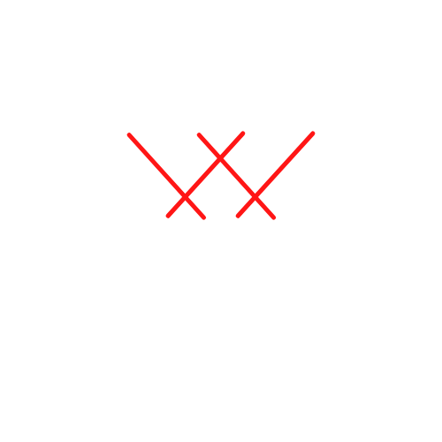

# WatchWolf

 

    

  
  
  
  

<i>WatchWolf</i> is an ambitious project whose aim is to
combine both data collection and data visualization into a single tool. 
Leveraging the cloud for our infrastructure, we provide resiliency and
performance to our customers.

---
# More information
Soon...
 